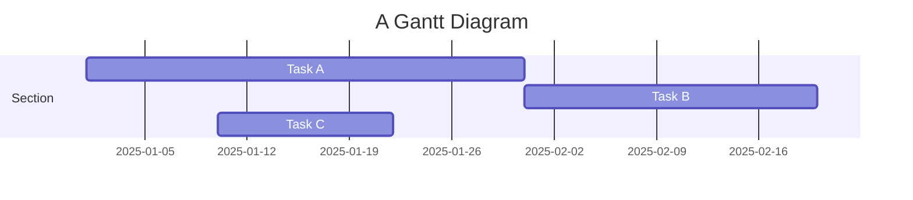
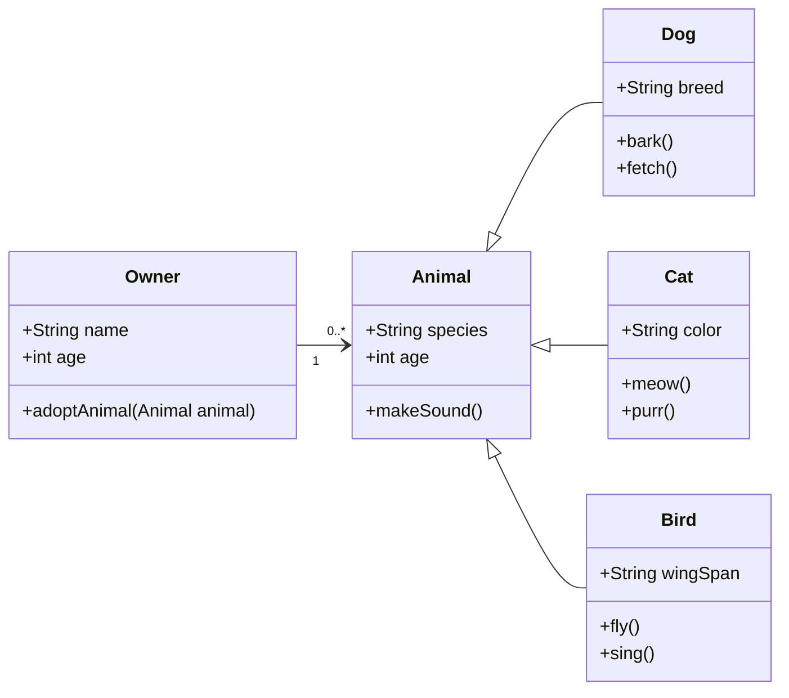

## Classical VS Quantum Computing

  Classical computers rely on bits as the fundamental unit of information, where each bit represents either a 0 or 1. These bits correspond to the presence or absence of electrical current flowing through a transistor – it can be thought of like a light switch that can either be “on” (1) or “off” (0). By manipulating sequences of these 1s and 0s, classical computers can execute a wide range of tasks and algorithms. Every program we create for a classical computer is a sequence of instructions that changes one set of bits into another step by step.
  
  While classical computers are, in theory, capable of executing any algorithm, there are limits to their computational power. Some algorithms require an impractically large number of steps, making them infeasible to compute in practice. This is where the allure of quantum computers begins – it is an exciting opportunity to overcome some of these classical limitations.
  
  Additionally, another challenge that sets a boundary to classical computational power is quantum tunneling (Seabaugh, 2013). As we continue to shrink transistors to fit more of them onto a microchip, we run into a weird quantum phenomenon where electrons can start jumping from transistor to transistor, causing errors in computation which creates a barrier to how small and powerful we can make microchips.


---

## How does a Quantum Computer Work?

  Every computer has a central processing unit (CPU), responsible for executing any set of instructions it receives. However, due to its versatility, the CPU is not always the most efficient at handling specific tasks. This is where specialized processing units (PUs), such as Graphics Processing Units (GPUs), come into play. GPUs are electronic circuits designed to quickly process and render images and videos.
  
	When people discuss the advent of quantum computing they are referring to the development of quantum chips that will receive specific instructions from a CPU. As a result, quantum computers will not operate as independent systems but as processing chips capable of performing tasks that are time-consuming for a CPU, such as complex number multiplication and addition (Ferrie, 2024).
 
	Quantum computers differ significantly from classical computers in that they can manipulate sequences of complex numbers (numbers like the square root of –1 and π) using qubits, rather than traditional bits. These computers accept programs that transform one sequence into another, enabling complex or inefficient classical algorithms to be rephrased as steps that alter sequences of complex numbers, rather than just 1s and 0s. By implementing these quantum algorithms, quantum computers can efficiently execute certain programs that would otherwise be infeasible for a classical computer.
 
	Qubits, much like classical bits, are used as the basic unit of information to encode data on a quantum computer. However, qubits are distinguished from classical bits, which must always be in the 0 or 1 state, by their ability to be in superposition states with varying probabilities that quantum operations can manipulate during computations.

  Ultimately, a quantum computer works by taking advantage of the unique properties of matter at the smallest scales, such as superposition and entanglement, to solve certain types of complex problems in far fewer steps than classical computers. The technology relies on qubits which sift through vast sets of probabilities using quantum interference to find the most likely answer.


---

## What is Superposition, Entanglement and Quantum Interference?

  Quantum mechanics is a theory that makes predictions about the behaviour of particles on the smallest scales, and the theory has been borne out of numerous experiments supporting the validity of quantum mechanics. Quantum mechanics can sometimes seem like science fiction due to the unintuitive ways in which these tiny particles behave. 

---

## Code Blocks

Syntax highlighting is provided within `<d-code>` tags.
An example of inline code snippets: `<d-code language="html">let x = 10;</d-code>`.
For larger blocks of code, add a `block` attribute:

<d-code block language="javascript">
  var x = 25;
  function(x) {
    return x * x;
  }
</d-code>

**Note:** `<d-code>` blocks do not look good in the dark mode. You can instead use the standard Jekyll syntax highlight with the `highlight` liquid tag.


var x = 25;
function(x) {
return x \* x;
}


You can also write standard Markdown code blocks in triple ticks with a language tag, for instance:

```python
def foo(x):
  return x
```

---

## Interactive Plots

You can add interative plots using plotly + iframes :framed_picture:

<div class="l-page">
  <iframe src="{{ '/assets/plotly/demo.html' | relative_url }}" frameborder='0' scrolling='no' height="500px" width="100%" style="border: 1px dashed grey;"></iframe>
</div>

The plot must be generated separately and saved into an HTML file.
To generate the plot that you see above, you can use the following code snippet:


import pandas as pd
import plotly.express as px
df = pd.read_csv(
'https://raw.githubusercontent.com/plotly/datasets/master/earthquakes-23k.csv'
)
fig = px.density_mapbox(
df,
lat='Latitude',
lon='Longitude',
z='Magnitude',
radius=10,
center=dict(lat=0, lon=180),
zoom=0,
mapbox_style="stamen-terrain",
)
fig.show()
fig.write_html('assets/plotly/demo.html')


---

## Details boxes

Details boxes are collapsible boxes which hide additional information from the user. They can be added with the `details` liquid tag:


Additional details, where math $$ 2x - 1 $$ and `code` is rendered correctly.


---

## Mermaid

This theme supports creating diagrams directly in markdown using [Mermaid](https://mermaid.js.org/). Mermaid enables users to render flowcharts, sequence diagrams, class diagrams, Gantt charts, and more. Simply embed the diagram syntax within a mermaid code block.

To create a Gantt chart, you can use the following syntax:

````markdown

````

And here’s how it will be rendered:


Similarly, you can also use it to create beautiful class diagrams:

````

````

It will be presented as:


With Mermaid, you can easily add clear and dynamic diagrams to enhance your blog content.

---

## Diff2Html

This theme also supports integrating [Diff2Html](https://github.com/rtfpessoa/diff2html), a tool that beautifully renders code differences (diffs) directly in markdown. Diff2Html is ideal for showcasing code changes, allowing you to clearly present additions, deletions, and modifications. It’s perfect for code reviews, documentation, and tutorials where step-by-step code changes need to be highlighted—you can even introduce changes across multiple files at once.

````markdown
```diff2html
diff --git a/utils/mathUtils.js b/utils/mathUtils.js
index 3b5f3d1..c7f9b2e 100644
--- a/utils/mathUtils.js
+++ b/utils/mathUtils.js
@@ -1,8 +1,12 @@
-// Basic math utilities
+// Extended math utilities with additional functions

-export function calculateArea(radius) {
-    const PI = 3.14159;
+export function calculateCircleMetrics(radius) {
+    const PI = Math.PI;
     const area = PI * radius ** 2;
+    const circumference = 2 * PI * radius;
+
+    if (!isValidRadius(radius)) throw new Error("Invalid radius");
+
     return { area, circumference };
 }

-export function validateRadius(radius) {
+export function isValidRadius(radius) {
     return typeof radius === 'number' && radius > 0;
 }

diff --git a/main.js b/main.js
index 5f6a9c3..b7d4e8f 100644
--- a/main.js
+++ b/main.js
@@ -2,9 +2,12 @@
 import { calculateCircleMetrics } from './utils/mathUtils';

-function displayCircleMetrics(radius) {
-    const { area } = calculateCircleMetrics(radius);
+function displayCircleMetrics(radius) {
+    const { area, circumference } = calculateCircleMetrics(radius);
     console.log(`Area: ${area}`);
+    console.log(`Circumference: ${circumference}`);
 }

-displayCircleMetrics(5);
+try {
+    displayCircleMetrics(5);
+} catch (error) {
+    console.error("Error:", error.message);
+}
```
````

Here’s how it will look when rendered with Diff2Html:

```diff2html
diff --git a/utils/mathUtils.js b/utils/mathUtils.js
index 3b5f3d1..c7f9b2e 100644
--- a/utils/mathUtils.js
+++ b/utils/mathUtils.js
@@ -1,8 +1,12 @@
-// Basic math utilities
+// Extended math utilities with additional functions

-export function calculateArea(radius) {
-    const PI = 3.14159;
+export function calculateCircleMetrics(radius) {
+    const PI = Math.PI;
     const area = PI * radius ** 2;
+    const circumference = 2 * PI * radius;
+
+    if (!isValidRadius(radius)) throw new Error("Invalid radius");
+
     return { area, circumference };
 }

-export function validateRadius(radius) {
+export function isValidRadius(radius) {
     return typeof radius === 'number' && radius > 0;
 }

diff --git a/main.js b/main.js
index 5f6a9c3..b7d4e8f 100644
--- a/main.js
+++ b/main.js
@@ -2,9 +2,12 @@
 import { calculateCircleMetrics } from './utils/mathUtils';

-function displayCircleMetrics(radius) {
-    const { area } = calculateCircleMetrics(radius);
+function displayCircleMetrics(radius) {
+    const { area, circumference } = calculateCircleMetrics(radius);
     console.log(`Area: ${area}`);
+    console.log(`Circumference: ${circumference}`);
 }

-displayCircleMetrics(5);
+try {
+    displayCircleMetrics(5);
+} catch (error) {
+    console.error("Error:", error.message);
+}
```

---

## Leaflet

[Leaflet](https://leafletjs.com/) is created by Ukrainian software engineer [Volodymyr Agafonkin](https://agafonkin.com/), allowing interactive maps to be embedded in webpages. With support for [GeoJSON data](https://geojson.org/), Leaflet allows you to highlight specific regions, making it easy to visualize geographical information in detail.

You can use the following code to load map information on [OpenStreetMap](https://www.openstreetmap.org/):

````markdown
```geojson
{
  "type": "FeatureCollection",
  "features": [
    {
      "type": "Feature",
      "properties": {
        "name": "Crimea",
        "popupContent": "Occupied Crimea"
      },
      "geometry": {
        "type": "Polygon",
        "coordinates": [
          [
            [
              33.9,
              45.3
            ],
            [
              36.5,
              45.3
            ],
            [
              36.5,
              44.4
            ],
            [
              33.9,
              44.4
            ],
            [
              33.9,
              45.3
            ]
          ]
        ]
      }
    },
    {
      "type": "Feature",
      "properties": {
        "name": "Donetsk",
        "popupContent": "Occupied Donetsk"
      },
      "geometry": {
        "type": "Polygon",
        "coordinates": [
          [
            [
              37.5,
              48.5
            ],
            [
              39.5,
              48.5
            ],
            [
              39.5,
              47.5
            ],
            [
              37.5,
              47.5
            ],
            [
              37.5,
              48.5
            ]
          ]
        ]
      }
    },
    {
      "type": "Feature",
      "properties": {
        "name": "Luhansk",
        "popupContent": "Occupied Luhansk"
      },
      "geometry": {
        "type": "Polygon",
        "coordinates": [
          [
            [
              38.5,
              49.5
            ],
            [
              40.5,
              49.5
            ],
            [
              40.5,
              48.5
            ],
            [
              38.5,
              48.5
            ],
            [
              38.5,
              49.5
            ]
          ]
        ]
      }
    },
    {
      "type": "Feature",
      "properties": {
        "name": "Kherson",
        "popupContent": "Occupied Kherson"
      },
      "geometry": {
        "type": "Polygon",
        "coordinates": [
          [
            [
              32.3,
              47.3
            ],
            [
              34.3,
              47.3
            ],
            [
              34.3,
              46.3
            ],
            [
              32.3,
              46.3
            ],
            [
              32.3,
              47.3
            ]
          ]
        ]
      }
    },
    {
      "type": "Feature",
      "properties": {
        "name": "Zaporizhzhia",
        "popupContent": "Occupied Zaporizhzhia"
      },
      "geometry": {
        "type": "Polygon",
        "coordinates": [
          [
            [
              34.3,
              48
            ],
            [
              36.3,
              48
            ],
            [
              36.3,
              47
            ],
            [
              34.3,
              47
            ],
            [
              34.3,
              48
            ]
          ]
        ]
      }
    }
  ]
}
```
````

The rendered map below highlights the regions of Ukraine that have been illegally occupied by Russia over the years, including Crimea and the four eastern regions:

```geojson
{
  "type": "FeatureCollection",
  "features": [
    {
      "type": "Feature",
      "properties": {
        "name": "Crimea",
        "popupContent": "Occupied Crimea"
      },
      "geometry": {
        "type": "Polygon",
        "coordinates": [
          [
            [
              33.9,
              45.3
            ],
            [
              36.5,
              45.3
            ],
            [
              36.5,
              44.4
            ],
            [
              33.9,
              44.4
            ],
            [
              33.9,
              45.3
            ]
          ]
        ]
      }
    },
    {
      "type": "Feature",
      "properties": {
        "name": "Donetsk",
        "popupContent": "Occupied Donetsk"
      },
      "geometry": {
        "type": "Polygon",
        "coordinates": [
          [
            [
              37.5,
              48.5
            ],
            [
              39.5,
              48.5
            ],
            [
              39.5,
              47.5
            ],
            [
              37.5,
              47.5
            ],
            [
              37.5,
              48.5
            ]
          ]
        ]
      }
    },
    {
      "type": "Feature",
      "properties": {
        "name": "Luhansk",
        "popupContent": "Occupied Luhansk"
      },
      "geometry": {
        "type": "Polygon",
        "coordinates": [
          [
            [
              38.5,
              49.5
            ],
            [
              40.5,
              49.5
            ],
            [
              40.5,
              48.5
            ],
            [
              38.5,
              48.5
            ],
            [
              38.5,
              49.5
            ]
          ]
        ]
      }
    },
    {
      "type": "Feature",
      "properties": {
        "name": "Kherson",
        "popupContent": "Occupied Kherson"
      },
      "geometry": {
        "type": "Polygon",
        "coordinates": [
          [
            [
              32.3,
              47.3
            ],
            [
              34.3,
              47.3
            ],
            [
              34.3,
              46.3
            ],
            [
              32.3,
              46.3
            ],
            [
              32.3,
              47.3
            ]
          ]
        ]
      }
    },
    {
      "type": "Feature",
      "properties": {
        "name": "Zaporizhzhia",
        "popupContent": "Occupied Zaporizhzhia"
      },
      "geometry": {
        "type": "Polygon",
        "coordinates": [
          [
            [
              34.3,
              48
            ],
            [
              36.3,
              48
            ],
            [
              36.3,
              47
            ],
            [
              34.3,
              47
            ],
            [
              34.3,
              48
            ]
          ]
        ]
      }
    }
  ]
}
```

---


